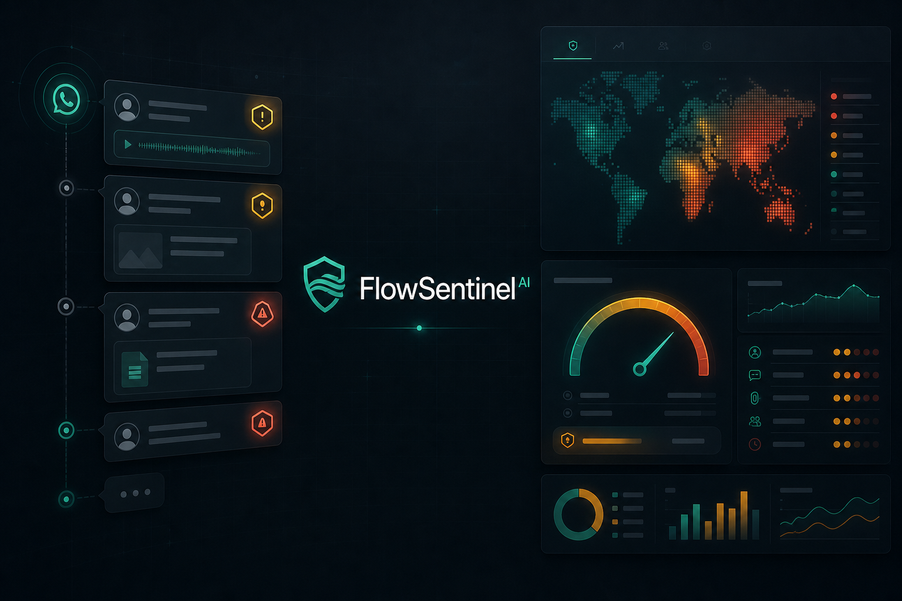
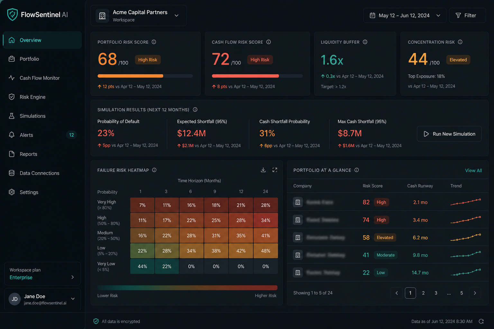
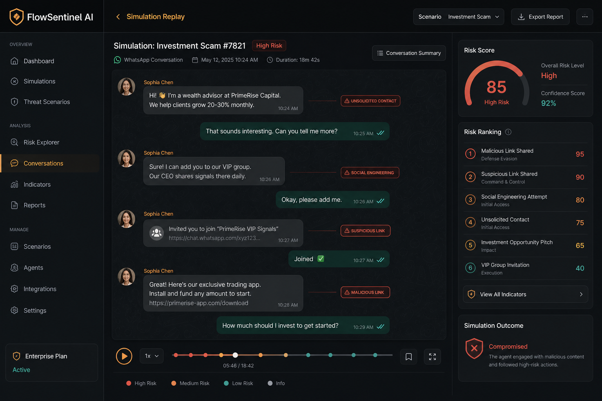
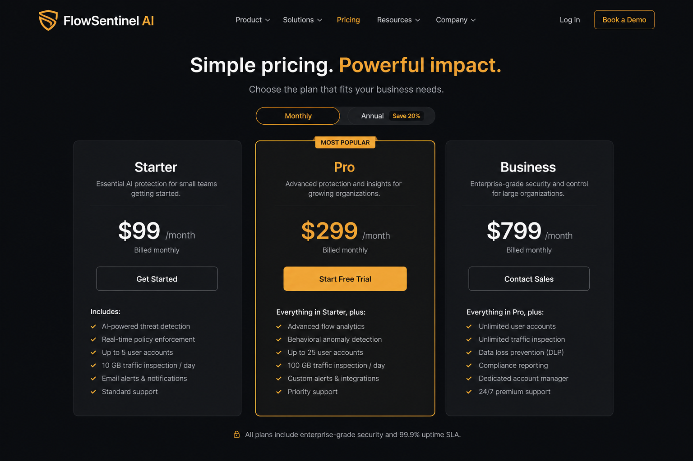
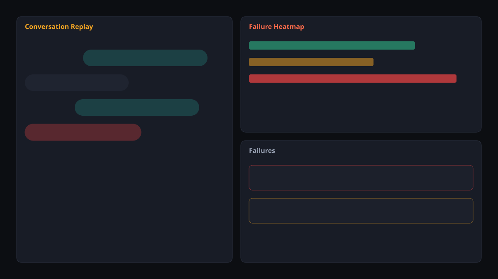
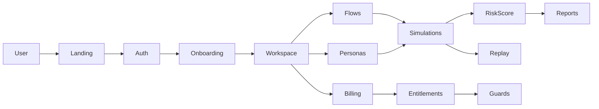

<div align="center">
  

  <h1>FlowSentinel AI</h1>

  <p><strong>Laboratório de QA, simulação e score de risco para agentes de atendimento por WhatsApp/IA.</strong></p>
  <p><strong>QA lab, simulation and risk scoring for WhatsApp/AI customer-support agents.</strong></p>

  <p>
    <a href="#-visão-geral--overview">PT-BR / English Overview</a> •
    <a href="#-product-preview">Preview</a> •
    <a href="#-screenshots">Screenshots</a> •
    <a href="#️-stack--tecnologias">Stack</a> •
    <a href="#-arquitetura--architecture">Architecture</a> •
    <a href="#-quick-start--início-rápido">Quick Start</a> •
    <a href="#-autor--author">Author</a>
  </p>

  <p>
    
    
    
    
    
    
  </p>
</div>

<p align="center">
  
</p>

---

## 1. Visão Geral / Overview

O **FlowSentinel AI** é um SaaS de QA operacional para times que usam agentes de atendimento com WhatsApp e IA. Ele transforma “a gente acha que o bot está ok” em **evidência**: fluxos versionados, personas simuladas, execução de testes, relatório de falhas, ranking por risco e regressão entre versões.

Em vez de um dashboard decorativo, o produto entrega um laboratório vendável: onboarding em minutos, dados demo realistas, billing preparado (mock → Stripe/Mercado Pago) e gating por plano.

O projeto foi desenvolvido por **Felipe Alirio Baruja** como peça de portfólio premium — e como base evolutiva para um produto pago real.

> **Product Notice**  
> FlowSentinel AI avalia **comportamento de agentes e fluxos de atendimento**. Ele não substitui supervisão humana em decisões críticas de saúde, crédito ou segurança.

---

## ✨ Product Preview

<p align="center">
  
</p>

Interface dark premium com cards de risco, timeline de conversa, heatmap de falhas e replay de simulação — pensada para recrutador e para cliente real entenderem valor em menos de 5 minutos.

---

## 2. Por que este projeto importa? / Why this project matters

* **IA no atendimento já é realidade:** pizzarias, clínicas, imobiliárias e agências adotam bots — mas sem QA estruturado.
* **Falha custa conversão e reputação:** resposta errada, loop, tom inadequado ou regressão após “melhoria” do prompt.
* **Evidência > feeling:** score de risco, falhas priorizadas e replay tornam o problema auditável.
* **SaaS monetizável de verdade:** planos, entitlements, webhooks idempotentes e upgrade path — não só UI.

---

## 🧠 O diferencial do FlowSentinel / What makes FlowSentinel different

### Português
Não é só um painel. É um laboratório de QA para agentes:

- cadastra fluxos e versões;
- define personas simuladas (cliente irritado, pedido incompleto, etc.);
- executa simulações e gera falhas;
- ranqueia risco;
- compara regressão entre versões;
- bloqueia recursos por plano (backend + UI).

### English
Not just a dashboard. A QA lab for support agents:

- register flows and versions;
- define simulated personas;
- run simulations and surface failures;
- rank risk;
- compare regression across versions;
- enforce plan entitlements (backend + UI).

---

## 🎯 Problema que resolve / The problem it solves

Operações enxutas com WhatsApp/IA enfrentam:

- bots que “funcionam no happy path” e quebram no mundo real;
- ausência de regressão após mudanças de prompt/fluxo;
- falta de evidência para cobrar melhoria do fornecedor/time;
- zero controle de uso, plano e cobrança em ferramentas internas;
- demos que não convencem cliente nem recrutador.

O **FlowSentinel AI** cria uma camada de QA, score e cobrança entre o agente e a operação.

---

## 🧩 Proposta / QA Simulation Pipeline

```txt
Fluxo de atendimento (versão)
  ↓
Persona simulada (cenário real)
  ↓
Execução de simulação (mock / AI adapter)
  ↓
Detecção de falhas + score de risco
  ↓
Replay da conversa + heatmap
  ↓
Ranking / regressão entre versões
  ↓
Exportação de relatório + gating por plano
```

---

## 📸 Screenshots

<table>
  <tr>
    <td width="50%">
      
      <br />
      <sub><strong>Risk Dashboard</strong> — score, KPIs, heatmap e visão executiva do workspace.</sub>
    </td>
    <td width="50%">
      
      <br />
      <sub><strong>Simulation Replay</strong> — timeline da conversa, falhas marcadas e ranking de risco.</sub>
    </td>
  </tr>
  <tr>
    <td width="50%">
      
      <br />
      <sub><strong>Pricing</strong> — Starter R$79 · Pro R$199 · Business R$499+/mês.</sub>
    </td>
    <td width="50%">
      
      <br />
      <sub><strong>Failure Heatmap</strong> — densidade de falhas por etapa do fluxo (SVG placeholder + UI live).</sub>
    </td>
  </tr>
</table>

---

## 📌 Estudo de Caso / Case Study

### 📌 Estudo de Caso: Pizzaria Flow (WhatsApp)
O seed demo simula a **Pizzaria Flow**: fluxo de pedidos via WhatsApp, personas (cliente com pressa, pedido incompleto, reclamação de atraso) e simulações com falhas de confirmação, loop e tom inadequado.

O dashboard mostra risco agregado, replay da conversa e regressão entre versões do fluxo — o suficiente para um time enxuto decidir o que corrigir primeiro.

### 📌 Case Study: Pizzaria Flow (WhatsApp)
The demo seed simulates **Pizzaria Flow**: order flow over WhatsApp, personas (rushed customer, incomplete order, late delivery complaint) and simulations with confirmation failures, loops and tone issues.

The dashboard shows aggregate risk, conversation replay and version regression — enough for a lean team to decide what to fix first.

**Demo login:** `demo@pizzariaflow.com.br` / qualquer senha com 6+ caracteres.

---

## 🧭 Visual Story / Jornada do Produto

```txt
1. Landing → entender a dor e o valor em 30s
2. Pricing → escolher Starter / Pro / Business
3. Signup / Login → entrar no workspace
4. Onboarding → criar workspace e carregar demo
5. Dashboard → ler risco e KPIs
6. Fluxos → cadastrar / versionar
7. Personas → definir cenários
8. Simulações → executar e abrir replay
9. Relatórios → exportar evidência (Pro+)
10. Billing / Upgrade → portal e limites claros
```

---

## ⚙️ Funcionalidades Principais / Core Features

### Risk Dashboard
Cards de risco, uso do plano, simulações recentes e atalhos para o próximo teste.

### Fluxos & Versões
CRUD de fluxos de atendimento com versionamento para regressão.

### Personas Simuladas
Personas com intenção, tom e gatilhos (ex.: pedido incompleto, cobrança, urgência).

### Simulation Runner
Execução mock (pronta) com adapter previsto para Vercel AI SDK (`OPENAI_API_KEY` / `XAI_API_KEY`).

### Replay & Heatmap
Timeline da conversa, falhas etiquetadas e densidade de erro por etapa.

### Billing Pronto
Camada `src/lib/billing/` com mock (dev), Stripe e Mercado Pago; webhooks idempotentes; entitlements por plano.

### Plan Guards
Limites de workspace, usuários, fluxos ativos, simulações/mês, histórico, exportação e automações — no backend e na UI.

---

## 🛠️ Stack / Tecnologias

### Frontend
- **Framework:** Next.js 15 (App Router) & React 19
- **Linguagem:** TypeScript
- **Estilização:** Tailwind CSS v4 + primitives estilo shadcn
- **Motion:** Framer Motion (landing / presença)
- **Ícones:** Lucide

### Backend / Plataforma
- **Auth & DB (preparado):** Supabase Auth + Postgres + RLS
- **Demo store:** localStorage seed (funciona sem credenciais)
- **Validação:** Zod
- **Billing:** adapter mock / Stripe / Mercado Pago
- **IA (previsto):** Vercel AI SDK adapters
- **Observabilidade (previsto):** Sentry + PostHog
- **Testes:** Vitest + Playwright (smoke)

---

## 🧱 Arquitetura / Architecture

```text
FlowSentinel-AI/
├── src/
│   ├── app/                      # Rotas App Router + APIs
│   │   ├── page.tsx              # Landing
│   │   ├── pricing|login|signup|onboarding
│   │   ├── app/                  # Shell autenticado (sidebar + topbar)
│   │   └── api/billing|webhooks|simulations
│   ├── components/               # UI + layout + domínio
│   └── lib/
│       ├── billing/              # plans, entitlements, providers, webhooks
│       ├── demo/                 # store, seed, runner
│       ├── supabase/             # clients opcionais
│       ├── types/ & validation/
├── supabase/migrations/          # schema + RLS
├── docs/                         # arquitetura, deploy, billing, pitch
├── assets/                       # icon, hero, screenshots
├── tests/                        # vitest + e2e smoke
└── README.md
```

Diagrama Mermaid (visão lógica):



Documentação detalhada: [docs/architecture.md](./docs/architecture.md) · [docs/data-model.md](./docs/data-model.md)

---

## 🚀 Quick Start / Início Rápido

### Pré-requisitos
- **Node.js** v20+
- **Git**
- (Opcional) projeto Supabase + chaves Stripe/Mercado Pago

### 1. Clone e instale

```bash
git clone https://github.com/BarujaFe1/FlowSentinel-AI.git
cd FlowSentinel-AI
npm install
cp .env.example .env.local
npm run dev
```

Abra [http://localhost:3000](http://localhost:3000).

### 2. Demo imediata
1. Vá em **Login**
2. Use `demo@pizzariaflow.com.br` e qualquer senha (6+ chars)
3. Explore dashboard → fluxos → simulações → replay

`NEXT_PUBLIC_DEMO_MODE=true` e `BILLING_PROVIDER=mock` já vêm preparados no `.env.example`.

---

## 🧪 Scripts e Testes / Scripts and Testing

```bash
npm run dev          # desenvolvimento
npm run lint         # ESLint
npm run typecheck    # TypeScript strict
npm run test         # Vitest (entitlements + webhook idempotente)
npm run build        # build de produção
npm run test:e2e     # Playwright smoke (requer browsers)
```

---

## 💳 Planos e Cobrança

| Plano | Preço | Destaques |
|-------|-------|-----------|
| **Starter** | R$ 79/mês | 1 workspace, 5 fluxos, 50 sims/mês |
| **Pro** | R$ 199/mês | exportação, mais limites, automações |
| **Business** | R$ 499+/mês | escala, SLA, limites altos |

Guias:
- [docs/stripe-setup.md](./docs/stripe-setup.md)
- [docs/mercadopago-setup.md](./docs/mercadopago-setup.md)
- [docs/handoff.md](./docs/handoff.md)

---

## 🛡️ Segurança e Boas Práticas

* RLS por workspace no schema Supabase
* Gating de plano no backend (não confiar só no frontend)
* Webhooks idempotentes com persistência de eventos
* `.env*` ignorado; apenas `.env.example` versionado
* Demo mode sem necessidade de secrets reais

---

## 🧭 Roadmap

* **MVP (agora):** landing, auth demo, onboarding, CRUD, simulações, billing mock, docs
* **Fase 2:** integrações WhatsApp reais, automações, templates, admin, auditoria avançada
* **Fora do MVP:** app nativo, marketplace, multi-idioma completo, modelos proprietários

---

## 💼 Valor para Portfólio / Portfolio Value

Demonstra:
- produto SaaS monetizável (não só CRUD);
- arquitetura full-stack com billing adapter;
- UX dark premium com estados vazios/loading/erro;
- QA de agentes como domínio de negócio claro;
- documentação de deploy e go-to-market.

Ver: [docs/portfolio-pitch.md](./docs/portfolio-pitch.md) · [docs/sales-playbook.md](./docs/sales-playbook.md)

---

## 📚 Documentação Complementar

- [docs/architecture.md](./docs/architecture.md)
- [docs/data-model.md](./docs/data-model.md)
- [docs/deploy-vercel.md](./docs/deploy-vercel.md)
- [docs/supabase-setup.md](./docs/supabase-setup.md)
- [docs/stripe-setup.md](./docs/stripe-setup.md)
- [docs/mercadopago-setup.md](./docs/mercadopago-setup.md)
- [docs/launch-checklist.md](./docs/launch-checklist.md)
- [docs/handoff.md](./docs/handoff.md)

---

## 🖼️ GitHub Social Preview

```txt
assets/social-preview.png
```

*Dimensão recomendada: 1280×640, &lt;1MB. Upload em: Repository Settings → Social Preview.*

---

## 🔖 GitHub Repository Metadata

### About sugerido
```txt
QA lab, simulation and risk scoring for WhatsApp/AI customer-support agents. Dark premium SaaS MVP with billing-ready architecture.
```

### Topics sugeridos
```txt
nextjs
typescript
supabase
saas
whatsapp
ai-agents
qa
billing
stripe
mercadopago
portfolio-project
tailwindcss
vitest
customer-support
```

---

## 👤 Autor / Author

Desenvolvido por **Felipe Alirio Baruja**.

- **Portfolio:** [barujafe.vercel.app](https://barujafe.vercel.app/)
- **GitHub:** [@BarujaFe1](https://github.com/BarujaFe1)
- **LinkedIn:** [Gustavo Felipe Alirio Baruja](https://www.linkedin.com/in/barujafe/)

---

## 📄 Licença / License

MIT License. Copyright (c) 2026 Felipe Alirio Baruja.
