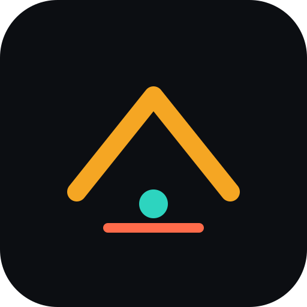
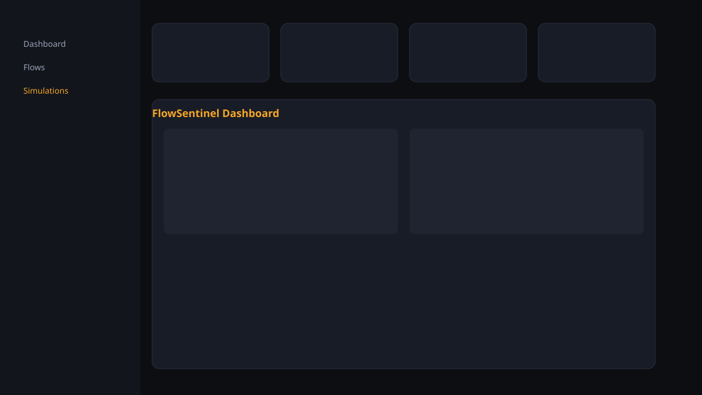

<div align="center">
  
  <h1>FlowSentinel AI</h1>
  <p><em>Lab de QA, cenários adversariais e score de risco para agentes de atendimento (WhatsApp/IA).</em></p>
  <p>
    <a href="https://flowsentinel-ai.vercel.app"></a>
    
    
    
  </p>
</div>

<p align="center">
  
</p>

> **Estado real:** MVP de laboratório / portfólio. Simulação **mock + cenários scriptados**. Billing **mock**. **Não** é integração WhatsApp de produção nem runner de LLM em produção.

---

## Problema e público

Times que colocam bots de atendimento (WhatsApp/chat) em operação precisam de evidência antes do go-live: o agente cede a pressão de reembolso? inventa tamanho de pedido? pede CVV no chat?

**Público:** operações enxutas, founders, e recrutadores avaliando engenharia full-stack / analytics de produto com domínio de QA de agentes.

## Solução e fluxo

1. Modelar **flows** versionados e **personas**
2. Rodar **cenários adversariais reproduzíveis** (ou runner probabilístico com seed)
3. Medir **pass rate**, **risk score** (severidade + agressividade) e **Δ risco vs baseline de agent build**
4. Revisar **replay + heatmap de peso de risco**
5. Empacotar o case **falha detectada no lab antes do go-live**

## O que este projeto demonstra

- Domínio de QA de agentes com métricas auditáveis (não dashboard decorativo)
- Suite adversarial determinística + versionamento de **agent build**
- Regressão real (`riskScore_atual - riskScore_baseline`), não número aleatório
- Camada de billing com adapter mock (entitlements)
- Demo zero-secret via `localStorage` + honestidade de escopo
- Testes + CI (lint / typecheck / test / build)

## Arquitetura (resumo)

```text
UI (/app) → DemoProvider (localStorage)
          → adversarial-scenarios + simulation-runner + scoring
          → reports / case study

API (lab) → billing adapters (mock|stripe|mercadopago)
          → webhook-router (idempotência in-memory / processo)
```

Detalhes: [docs/ARCHITECTURE.md](./docs/ARCHITECTURE.md) · [docs/TECHNICAL_DECISIONS.md](./docs/TECHNICAL_DECISIONS.md)

## Decisões e trade-offs

| Decisão | Trade-off |
|----------|-----------|
| Cenários scriptados no lab | Evidência reproduzível; sem LLM real |
| Agent builds como metadados | Versionamento legível; sem snapshot completo de prompt blob |
| Demo em localStorage | Onboarding em segundos; sem multi-device |
| Mock billing | Demo pública segura; sem cobrança |
| Idempotência in-memory | Mostra o padrão; não sobrevive a cold start |

## Estado, demo e limitações

| | |
|---|---|
| **Demo** | https://flowsentinel-ai.vercel.app |
| **Login** | `demo@pizzariaflow.com.br` / senha 6+ chars (`demo123`) |
| **Billing** | `BILLING_PROVIDER=mock` |
| **Deploy** | Branch de qualidade pode estar **à frente** de `main`/Vercel — confirme a UI de cenários adversariais; se ausente, o alias ainda serve build antigo |

**Limitações explícitas:** sem WhatsApp real, sem auth JWT, APIs de lab abertas, webhooks sem persistência durable, Mercado Pago sem verificação de assinatura.

## Quick start

```bash
git clone https://github.com/BarujaFe1/FlowSentinel-AI.git
cd FlowSentinel-AI
npm install
cp .env.example .env.local
npm run dev
```

```bash
npm run lint && npm run typecheck && npm run test && npm run build
```

## Testes / gates

- Entitlements, webhook idempotency, demo store, **scoring + adversarial**
- CI: `.github/workflows/ci.yml`
- Guia: [docs/TESTING.md](./docs/TESTING.md) · demo guiada: [docs/DEMO_GUIDE.md](./docs/DEMO_GUIDE.md)

## Case study (lab)

[Pré-produção: reembolso fora de política](./docs/CASE_PRE_PROD_REFUND.md) · rota in-app `/app/cases/pre-prod-refund`

## Roteiro de entrevista (≈5 min)

1. Problema (30s) — bots sem evidência antes do go-live  
2. Demo login → Case study → replay v2 vs v3 (2 min)  
3. Rodar cenário adversarial com builds vulnerável/guardrail (1–2 min)  
4. Trade-offs: mock vs produção, o que falta (WhatsApp, auth, LLM eval) (1 min)  

Pitch: [docs/portfolio-pitch.md](./docs/portfolio-pitch.md) · handoff: [docs/PORTFOLIO_HANDOFF.md](./docs/PORTFOLIO_HANDOFF.md)

## Screenshots

| | |
|---|---|
| Dashboard | [`assets/screenshots/dashboard.svg`](./assets/screenshots/dashboard.svg) |
| Replay | [`assets/screenshots/simulation-replay.svg`](./assets/screenshots/simulation-replay.svg) |
| Captura | [docs/SCREENSHOTS.md](./docs/SCREENSHOTS.md) |

## Autor

**Felipe Alírio Baruja** — software + Estatística/Ciência de Dados (USP)  
[Portfolio](https://barujafe.vercel.app/) · [GitHub](https://github.com/BarujaFe1) · [LinkedIn](https://www.linkedin.com/in/barujafe/)

## License

MIT © 2026 Felipe Alírio Baruja
